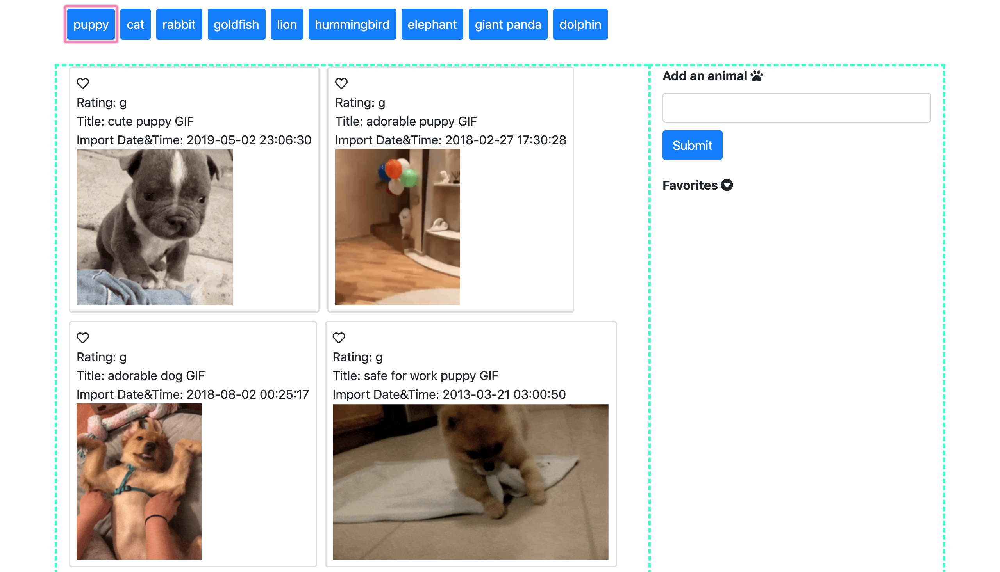
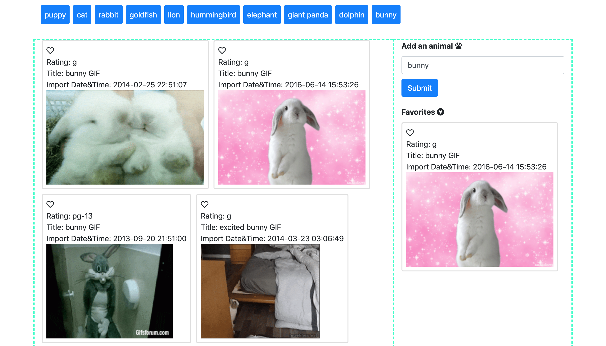

# GifTastic

### Role & Contact Information 
Front-end Web Developer 

General inquiries at ddzhang2018@gmail.com.

### Description
GifTastic is a dynamic web page that display the results of chosen gifs by making an ajax call to the GIPHY API.

You can also add an animal of your choice and display it on the tags section. Click on the heart at the right corner of each card to make it your favorites! 

### Technologies 
- HTML
- CSS
- JavaScript
- jQuery
- API calls
 
### Link to GifTastic 
https://dzhangcoder.github.io/GifTastic/
